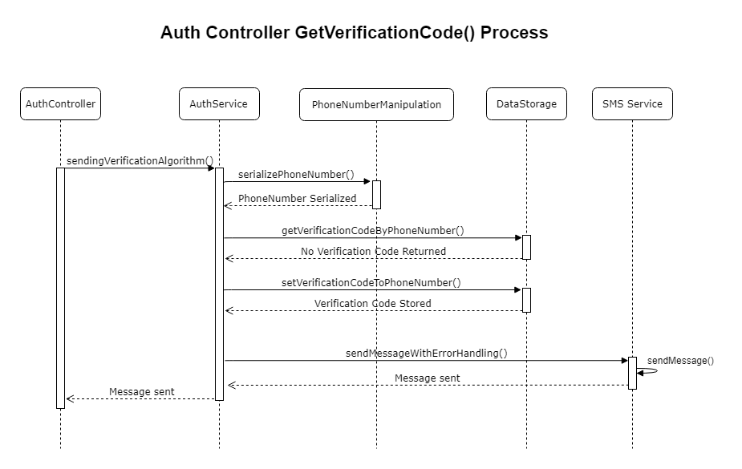

# PNV (Phone Numbers Verification) API

## Description

A simple API to verify users' phone number

## Installation

```bash
$ npm install
```

## Running the app

```bash
# development
$ npm run start

# watch mode
$ npm run start:dev

# production mode
$ npm run start:prod
```

## Test

```bash
# unit tests
$ npm run test

# test coverage
$ npm run test:cov
```

## Architecture

### Process Diagrams


