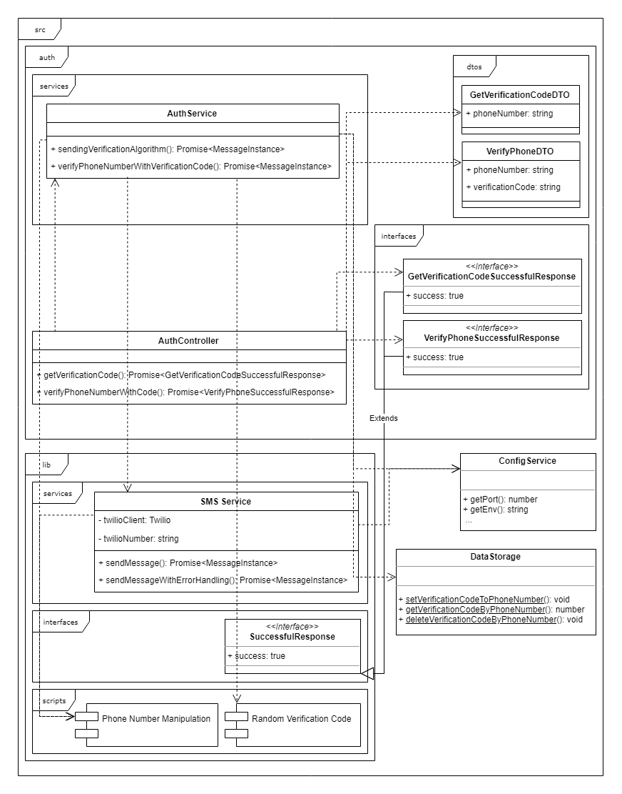
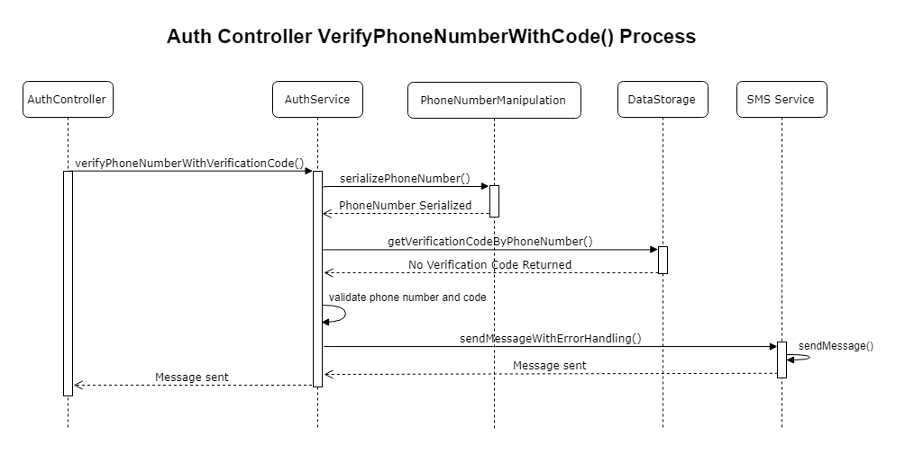

# PNV (Phone Numbers Verification) API

## Description

A simple API to verify users' phone number. Made with ❤ by Iván Sánchez

## Installation

```bash
$ npm install
$ cp .env.example .env # and add your credentials following the example data
```

## Running the app

```bash
# development
$ npm run start

# watch mode
$ npm run start:dev

# production mode
$ npm run start:prod
```

## Test

```bash
# unit tests
$ npm run test

# test coverage
$ npm run test:cov
```

## Important notes

- The user stories has one example of a valid phone format that this API is not fulfilling (+52-12-3456-7890) the API throws an exception with this number. That is because the phone number validation checks against more than just the simple format. It internally make use of the [google-libphonenumber](https://github.com/ruimarinho/google-libphonenumber/blob/1e46138878cff479aafe2ce62175c6c49cb58720/src/metadata.js#L33) library that check not only the country code, but also the region code. And after googling it seems like there are only tree 2 digit codes (55, 33 y 81) in Mexico. Non of them is "12".
- With a free trial twilio account. Every message sent through this API is going to be preceded with: "Sent from your Twilio trial account"
- If you are making use of a free trial twilio account. Every phone numbers you want to send messages to, needs to be verified on the twilio dashboard
- The user story 3 requests a functionality to _resend the verification code_. At first I think in adding another endpoint for that. But then I realized that I could make use of the same algorithm. So the current behavior on that algorithm is: It search the number the user is requesting to verify on the `DataStorage` if the phone number is saved, that means that the API already tried to send (or sent) a code to that phone. So the API just resend the same code.
- There user stories just says that the manager wants to enter the verification code to verify the phone number. On the endpoint for verification I ask for both. The `verification code` and the `phone number` there is a good reason for that. Verifying only with the code we will be limited up to 9999 pending verification requests at the same time. That is because the codes must be different such that we can validate and send the message to the correct number. Also it is more secure this way.
- Currently this project saves the data in-memory due to simplicity, to the time constraint and to be easy to run. In a real world scenario. We should consider to use Redis, Mongo or a relational database to persist data after a process restart and to make this project stateless. Using Redis for example. This project could easily work in conjunction with a load balancer or in cluster mode.
- I am also very pleased to say that this code has an unbelievable **100% test coverage** ✨

## Documentation

This project automatically generates a [OpenAPI(Swagger)](https://swagger.io/docs/specification/about/) specification based document 📑 that is exposed using [SwaggerUI](https://swagger.io/tools/swagger-ui/)

After running the project just go to: [http://localhost:3000/developers](http://localhost:3000/developers)  
This UI also serves as a REST client. So every requests to the API can be tested directly from your browser 👍

## Architecture

### Class Diagrams



### Process Diagrams




### Behavioral Code Analysis

[ Get more details at **codescene.io**.](https://codescene.io/projects/4967/jobs/latest-successful/results)
